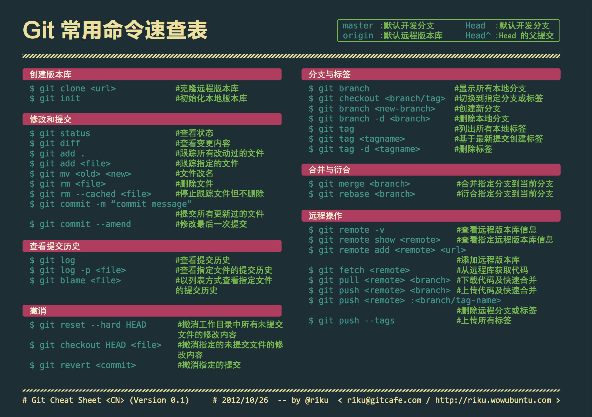
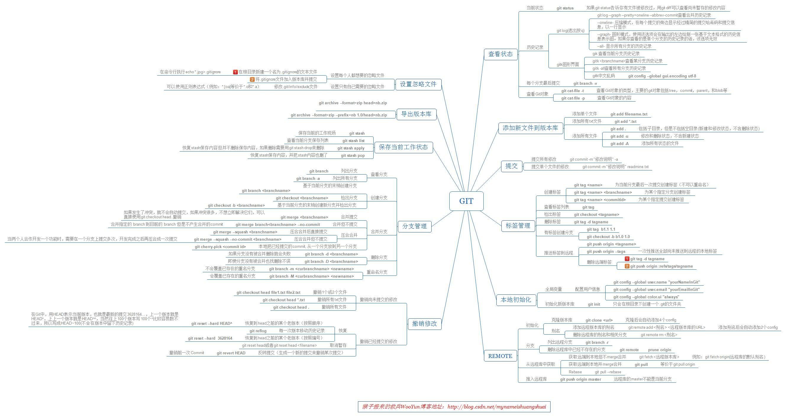
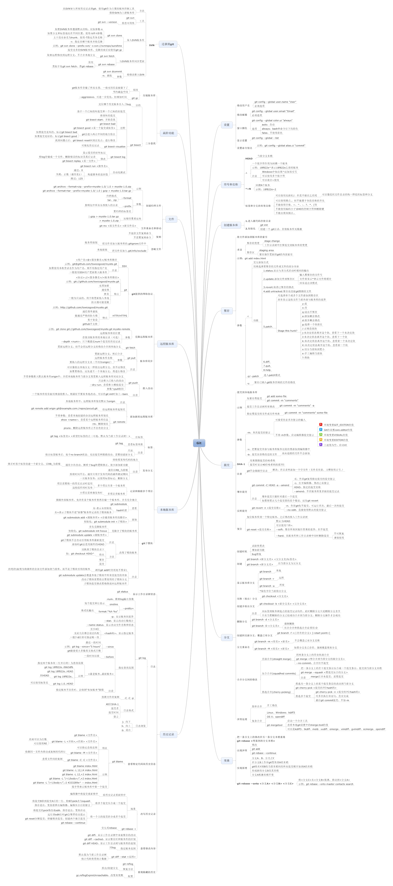

# git-notes

## 参考教程

- [Git 官网](https://git-scm.com/)
- [Pro Git book](https://git-scm.com/book/zh/v2)
- [廖雪峰Git教程](https://www.liaoxuefeng.com/wiki/0013739516305929606dd18361248578c67b8067c8c017b000/)
- [runoob git](http://www.runoob.com/git/git-tutorial.html)

## 在线

- [github](https://github.com)
- [gitlab](https://about.gitlab.com)
- [gitee](https://gitee.com)

## 笔记

- [Git常用命令集合](./command.md)
- [Git 笔记](./notes.md)

## 图谱

