# Git 笔记

`用于总结，不然看完啥也不做等于白嫖`


## 版本管理的演变

VCS 出现前
- 用目录拷贝区别不同的版本
- 公共文件容易被覆盖
- 成员沟通成本很高，代码集成效率低下

集中式 VCS
- 有集中2的版本管理服务器
- 具备文件版本管理和分支管理能力
- 集成效率有明显的提高
- 客户端必须时刻和服务器相连


分布是 VCS
- 服务端和客户端都有完整的版本库
- 脱离服务端，客户端照样可以管理版本
- 查看历史和版本比较等操作，都不需要访问服务器，比集中式 VCS 更能提高版本管理效率


Git 的特点
- 最优的存储能力
- 非凡的性能
- 开源的
- 很容易做备份
- 支持离线操作
- 很容易定制工作流程


## 安装 Git

链接： https://git-scm.com/book/zh/v2

```bash
git --version
```

## Git 小配置

配置 User.name 和 user.email

```bash
git config --global user.name "user.name"
git config --global user.email "user.email@email.com"
```

config 的三个作用

缺省等同于 local
```
git config --local      // 只有某个仓库有效
git config --global     // 对当前用户所有仓库有效
git config --system     // 对系统所有登录的用户有效
```

显示 config 的配置, 加 --list
```
git config --list --local      // 只有某个仓库有效
git config --list --global     // 对当前用户所有仓库有效
git config --list --system     // 对系统所有登录的用户有效
```

清除，--unset
```
git config --unset --local user.name
git config --unset --global user.name
git config --unset --system user.name
```

优先级： local > global > system

```
local：区域为本仓库
global: 当前用户的所有仓库
system: 本系统的所有用户
```


### 实践

请动⼿⽐⼀⽐，local 和 global 的优先级。
1. 在 Git 命令⾏⽅式下，⽤ init 创建⼀个 Git 仓库。
```
git init your_first_git_repo_name
```
2. cd 到 repo 中。
```
cd your_first_git_repo_name
```
3. 配置 global 和 local 两个级别的 user.name 和 user.email。
```
git config --local user.name 'your_local_name'
git config --local user.email 'your_local_email@.'
git config --global user.name 'your_global_name'
git config --global user.name 'your_global_eamil@.'
```
4. 创建空的 commit
```
git commit --allow-empty -m ‘Initial’
```
5. ⽤ log 看 commit 信息，Author 的 name 和 email 是什么？
```
git log
```


## 建 Git 仓库


两种⽅方式：
1. ⽤ Git 之前已经有项⽬目代码
```
cd 项⽬目代码所在的⽂文件夹
git init
```

2. 用 Git 之前还没有项⽬目代码
```
cd 某个⽂文件夹
git init your_project # 会在当前路路径下创建和项⽬目名称同名的⽂文件夹
cd your_project
```


## 给文件重命名的简便方法

```
mv readme readme.md
git add  readme.md
git rm readme

git status
git reset --hard

git mv readme readme.md
```

git add . 和 git add -u区别
```
git add . ：将工作空间新增和被修改的文件添加的暂存区
git add -u :将工作空间被修改和被删除的文件添加到暂存区(不包含没有纳入Git管理的新增文件)
```


额外： git add -u 可以添加所有已经被 git 控制的文件到暂存区 以前删除文件夹只会用 「-rf」，get到了 「-r」，并得知它们两个区别：「-r」 有时候会提示是否确认删除。


Tag标签: 显示已有标签
```
git tag
```

新建标签: 创建一个含附注类型的标签非常简单，用 -a （译注：取 annotated 的首字母）指定标签名字即可
```
git tag -a tag_name -m 'Some Messages'
```

删除本地标签:
```
git tag -d tag_name
```

删除remote标签 :
```
git push --delete origin tag_name
```

推送标签到github 将本地所有标签推送到remote:
```
git push origin --tags
```


## 通过git log 查看版本演变历史

```
git log
git log --oneline
git log -n4 --oneline

git branch -v

git checkout -b temp 455jjk
git commit -am 'commit msg'

git log --all                       # 查看所有分支的历史
git log --graph                     # 查看图形化的 log 地址
git log --oneline                   # 查看单行的简洁历史
git log --oneline -n4               # 查看最近的4条简洁历史
git log --oneline --all -n4 --graph 查看所有分支最近4条单行的图形化历史。
```

```
git branch -v   # 查看本地有多少分支
```

## gitk：通过图形界面工具来查看版本历史

```
gitk  # 会自动打开图形化界面
```


## 探密.git目录

```
cd .git
cat HEAD
git branch -av

cat config
vi .git/config
git config --local --list

cat master
git branch -av

```

```
ls -al
```

```
查看.git文件夹下的内容：

ls .git/ -al
```

如下:
```
total 22
drwxr-xr-x 1 ShenBao 197121    0 3月   9 22:54 ./
drwxr-xr-x 1 ShenBao 197121    0 3月   2 22:27 ../
-rw-r--r-- 1 ShenBao 197121   18 3月   9 22:54 COMMIT_EDITMSG
-rw-r--r-- 1 ShenBao 197121  299 3月   2 22:26 config
-rw-r--r-- 1 ShenBao 197121   73 3月   2 22:26 description
-rw-r--r-- 1 ShenBao 197121  175 3月   4 21:37 gitk.cache
-rw-r--r-- 1 ShenBao 197121   23 3月   2 22:26 HEAD
drwxr-xr-x 1 ShenBao 197121    0 3月   2 22:26 hooks/
-rw-r--r-- 1 ShenBao 197121 1602 3月   9 22:54 index
drwxr-xr-x 1 ShenBao 197121    0 3月   2 22:26 info/
drwxr-xr-x 1 ShenBao 197121    0 3月   2 22:26 logs/
drwxr-xr-x 1 ShenBao 197121    0 3月   9 22:54 objects/
-rw-r--r-- 1 ShenBao 197121  114 3月   2 22:26 packed-refs
drwxr-xr-x 1 ShenBao 197121    0 3月   2 22:26 refs/
```

```
cat命令主要用来查看文件内容，创建文件，文件合并，追加文件内容等功能。
cat HEAD 查看HEAD文件的内容
git cat-file 命令 显示版本库对象的内容、类型及大小信息。
git cat-file -t b44dd71d62a5a8ed3 显示版本库对象的类型
git cat-file -s b44dd71d62a5a8ed3 显示版本库对象的大小
git cat-file -p b44dd71d62a5a8ed3 显示版本库对象的内容
```

.git里几个常用的如下：
```
HEAD：指向当前的工作路径
config：存放本地仓库（local）相关的配置信息。
refs/heads: 存放分支
refs/heads/master/: 指向master分支最后一次commit
refs/tags: 存放tag，又叫里程牌 （当这次commit是具有里程碑意义的 比如项目1.0的时候 就可以打tag）
objects：核心文件，存储文件
```

.git/objects/ 存放所有的 git 对象，对象哈希值前 2 位作为文件夹名称，后 38 位作为对象文件名, 可通过 git cat-file -p 命令，拼接文件夹名称+文件名查看。


## commit、tree和blob三个对象之间的关系


```
git cat-file -p xxx-id      # 可以一直往下去查询 
```

```
commit: 提交时的镜像
tree: 文件夹
blob: 文件
```

【问题】 每次commit，git 都会将当前项目的所有文件夹及文件快照保存到objects目录，如果项目文件比较大，不断迭代，commit无数次后，objects目录中文件大小是不是会变得无限大？

【解答】 Git对于内容相同的文件只会存一个blob，不同的commit的区别是commit、tree和有差异的blob，多数未变更的文件对应的blob都是相同的，这么设计对于版本管理系统来说可以省很多存储空间。其次，Git还有增量存储的机制，我估计是对于差异很小的blob设计的吧。

## 小练习：数一数tree的个数


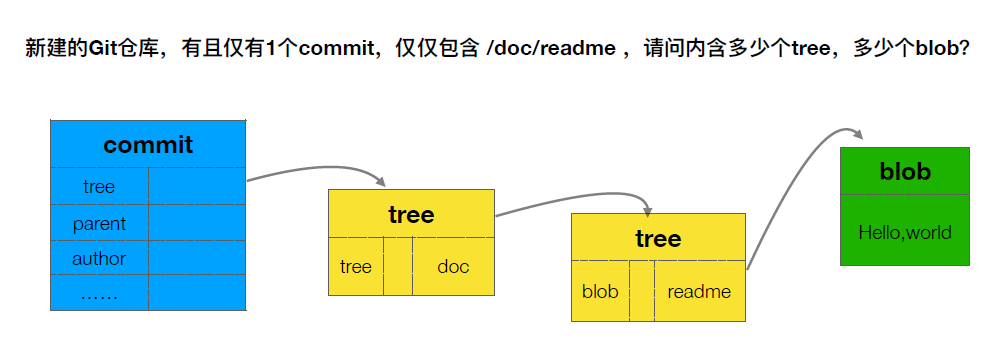


```
find .get/objects -type -f
git cat-file -t xxx-id
git cat-file -p xxx-id
git commit -m 'msg'
find .get/objects -type -f
git cat-file -t xxx-id
git cat-file -p xxx-id
```


## 分离头指针情况下的注意事项

detached HEAD

```
git checkout commit-id
修改某个文件
git commit -am 'msg'
git log
git checkout master
git branch <new-branch-name> 'commit-msg-id'    # 按照提示创建一个分支

```


## 进一步理解HEAD和branch

```
git branch -av

git checkout -b new-branch-name branchName-or-commitId

git log -n1

gitk --all

cat .get/HEAD

cat .get/refs/heads/branch-name     # 这里输出是一个 commit-id

get cat-fiel -t commit-id       # 这里输出的类型是 commit


git diff branch-name-1 branch-name-2

git diff HEAD HEAD~1
git diff HEAD HEAD^1
git diff HEAD HEAD^1^1 
git diff HEAD HEAD~2
```


## 怎么删除不需要的分支？

```
查看分支：
git branch -av
```

```
git branch -d branch-name

git branch -D branch-name       # 强制删除、确认无误之后再执行
```


## 怎么修改最新commit的message

```
git commit -amend       # 对最近一次的commit信息进行修改
```


## 怎么修改老旧commit的message

```
git rebase -i 目标commit-id的上一个id
```

还有后续步骤，按照提示即可


## 怎样把连续的多个commit整理成1个
```
git rebase -i commit-m

将要合并的 commit-commands 改为 squash(s)

填写合并说明

git log --graph

```


## 怎样把间隔的几个commit整理成1个

```
git rebase -i commit-m

移动要合并commit list 在一起

将要合并的 commit-commands 改为 squash(s)

填写合并说明

git log --graph

```


## 怎么比较暂存区和HEAD所含文件的差异

```
git diff --cached

git diff --staged

```


## 怎么比较工作区和暂存区所含文件的差异

```
git diff
git diff -- <file> <file2>
```

## 如何让暂存区恢复成和HEAD的一样？

```
git reset HEAD
git reset HEAD fileName
git diff --cached       # 对比一下
```

```
git reset 有三个参数
--soft 这个只是把 HEAD 指向的 commit 恢复到你指定的 commit，暂存区 工作区不变
--hard 这个是 把 HEAD， 暂存区， 工作区 都修改为 你指定的 commit 的时候的文件状态
--mixed 这个是不加时候的默认参数，把 HEAD，暂存区 修改为 你指定的 commit 的时候的文件状态，工作区保持不变
```

## 如何让工作区的文件恢复为和暂存区一样？

```
git checkout -- <file>
```

恢复工作区用checkout，恢复暂存区用reset。


## 怎样取消暂存区部分文件的更改？

```
git reset HEAD -- <file>
```

## 消除最近的几次提交

```
git reset --hard commit-id
```


## 看看不同提交的指定文件的差异

```
git diff branch-name branch-name -- <file>
git diff commit-id commit-id -- <file>
```


## 正确删除文件的方法

```
rm fileName

git rm <file>
```

## 开发中临时加塞了紧急任务怎么处理？

```
git stash list #查看stash中存放的信息

git stash #将当前工作区内容存放到"堆栈"中

git stash apply #把"堆栈"里面的内容弹出到工作区中，同时"堆栈"中信息还在

git stash pop #把"堆栈"里面的内容弹出到工作区中，同时丢弃"堆栈"中最新的信息
```


## 如何指定不需要Git管理的文件？

.gitignore
```
*.d
./dist
```

【提问】 如果提交commit后，想再忽略一些已经提交的文件，怎么处理。

【回答】 The problem is that .gitignore ignores just files that weren't tracked before (by git add). Run git reset name_of_file to unstage the file and keep it. In case you want to also remove given file from the repository (after pushing), use git rm --cached name_of_file.

把想忽略的文件添加到 .gitignore ；然后通过 git rm -- cached name_of_file 的方式删除掉git仓库里面无需跟踪的文件。


### git修改gitignore后生效

```
git rm -r --cached .    #清除缓存
git add .               #重新trace file
git commit -m "update .gitignore" #提交和注释
git push origin master  #可选，如果需要同步到remote上的话
```

## 如何将Git仓库备份到本地？


常⽤用的传输协议

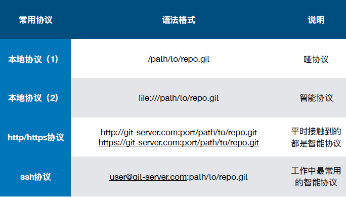


哑协议与智能协议
- 直观区别：哑协议传输进度不可见；智能协议传输可见。
- 传输速度：智能协议⽐哑协议传输速度快。


备份特点

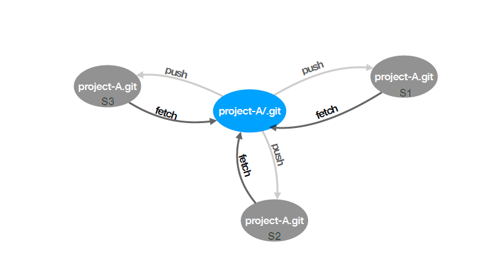

```
git remote -v
git remote add xxx xxx
```

## 注册一个GitHub账号

https://github.com

https://guides.github.com/

https://help.github.com/


## 配置公私钥

```
# 检查是否已经有ssh
ls -al ~/.ssh

ssh-keygen -t rsa 4096 -C 'email@email.com'

cat id_rsa.pub

```

在这个位置配置：
https://github.com/settings/keys


=============具体步骤===========

1、 检查是否已存在相应的ssh key:
打开终端, 输入:
```
ls -al ~/.ssh
```
核对列出来的`ssh key`是否有已存在的，假如你没有看到列出的公私钥对，或是不想再用之前的公私钥对，你可以选择下面的步骤生成新的公私钥对.

2、生成新的ssh key,并添加至`ssh-agent`:
打开终端, 使用ssh key生成命令：
```
ssh-keygen -t rsa -b 4096 -C "your_email@example.com"
```
注意 ：后面的邮箱对应相应账号的邮箱，假如是github的账号，且注册账号的邮箱为xxxx@qq.com，则命令行为：`ssh-keygen -t rsa -b 4096 -C "xxxx@qq.com`。

3、接下来会提示你保存的ssh key的名称以及路径。默认路径是(/Users/you/.ssh/id_rsa) (you为用户个人目录)。这一步很重要，如果你使用默认的，且下一个账号也是使用默认的路径和文件名，那么之前的ssh key就会被后来生成的ssh key重写，从而导致之前的账号不可用。因此，正确的做法是给它命名，最后以应用名进行命名，因为更容易区分。以下是我个人配的：
```
/Users/andy/.ssh/github_rsa
```

4、接下来会提示设置ssh安全密码。这一步可以使用默认的（即不设置密码），直接按回车即可。倘若想了解更多关于ssh key密码设置的细节，可访问： “Working with SSH key passphrases” 。

5、 ssh key生成后，接下来需要为ssh key添加代理，这是为了让请求自动对应相应的账号。网上很多文章写到需要另外配置config文件，经本人亲测，其实是不需要的，在生成了ssh key后，通过为生成的ssh key添加代理即可，为ssh key添加代理命令：`ssh-add ~/.ssh/xxx_rsa,xxx_rsa`是你生成的ssh key的私钥名。

6、连接测试

接下来我们测试是否配置成功，打开终端，输入:
```
ssh -T git@github.com
```

## 在GitHub上创建个人仓库

https://github.com/new

注意： 关于.gitignone、license 的选择


## 把本地仓库同步到GitHub

```
git remote add github git@github.com:xxx/xxx.git

git remote -v

git push github --all

gitk --all

git fetch github master

git branch -v

git branch -va

git checkout master

# 俩个毫无关系的分支合并
git merge --allow-unrelated-histories github/amster

```

## 不同人修改了不同文件如何处理？

```
# 默认创建 xxx文件夹
git clone git@github.com:xxx/xxx.git

# 创建 xxx_002
git clone git@github.com:xxx/xxx.git xxx_002


# =================== A 操作 ===================

cd xxx_002

git config --add --local user.name 'get_test'

git config --local --list

git config --add --local user.email 'get_test'

vi .git /config

git checkout -b feature/add_git_commands origin/feature/add_git_commands

vi readme.md

git add -u

git status

git commit -m 'add git commit description in readme'

git push


# =================== B 操作 ===================

cd xxx

git fetch github

git branch -av

git checkout -b feature/add_git_commands origin/feature/add_git_commands

vi index.html

git add -u

git commit -m 'add git commit description in index.html'

# 暂时不 push


# =================== A 操作 ===================

vi readme.md

git add -am 'fix readme'

git push

# =================== B 操作 ===================

git push    # 这里 push 失败

git fetch github

git merge github/feature/add_git_commands

git push

```


## 不同人修改了同文件的不同区域如何处理？

自动合并

注意检查文件，根据实际来操作


## 不同人修改了同文件的同一区域如何处理？


自动合并

手动解决冲突

```
git commit -m 'msg'

git merge --abort
```


## 同时变更了文件名和文件内容如何处理？

```
A. 变更文件名
B. 变更文件内容

git 会自动智能的处理
```


## 把同一文件改成了不同的文件名如何处理？

```
A. 变更文件名
B. 变更文件名

需要手动解决

git rm <file.file>
git add <file.file>
```

## 禁止向集成分支执行push -f操作

-f ,--force

```
git reset --hard commit_id
git push -f
```

`注：会丢失历史，谨慎操作`


## 禁止向集成分支执行变更历史的操作

`禁止向集成分支执行变更历史的操作, 在现有基础进行改造`


## GitHub为什么会火？

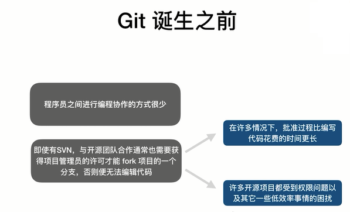

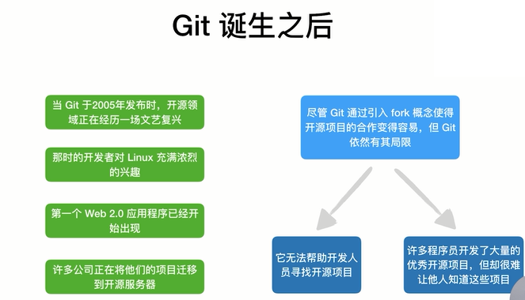


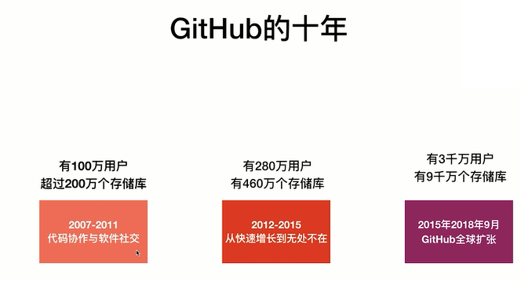


## GitHub都有哪些核心功能？

https://github.com/features

https://github.com/marketplace


## 怎么快速淘到感兴趣的开源项目

UI界面高级搜索：https://github.com/search/advanced

git 最好 学习 资料

git 最好 学习 资料 in:readme

git 最好 学习 资料 in:readme stars：>1000


`巧用高级搜索`


## 怎样在GitHub上搭建个人博客

jekyll


## 开源项目怎么保证代码质量？

Pull requests

Ci

如：reaction

## 为何需要组织类型的仓库？

https://github.com/settings/organizations

Rep、PeoPle、Team、...


## 创建团队的项目

- Name
- Descriptions
- Public、Private
- README
- .gitignore
- License

- 配置权限


## 怎样选择适合自己团队的工作流？

需要考虑的因素
- 团队人员的组成
- 研发设计能力
- 输出产品的特征
- 项目难以程度

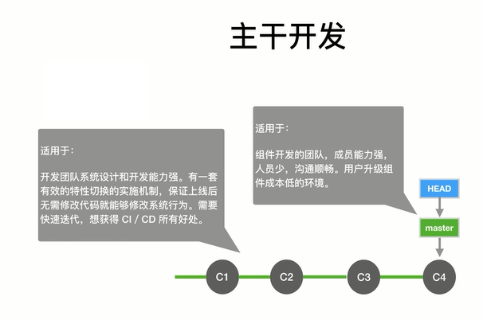

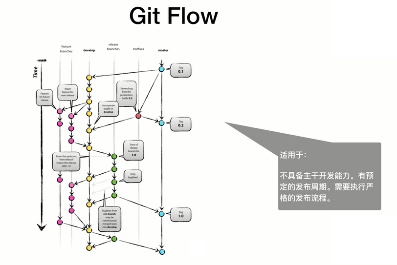

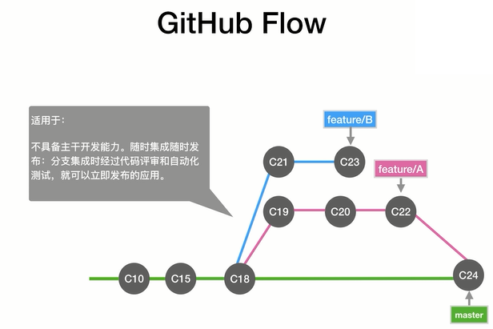

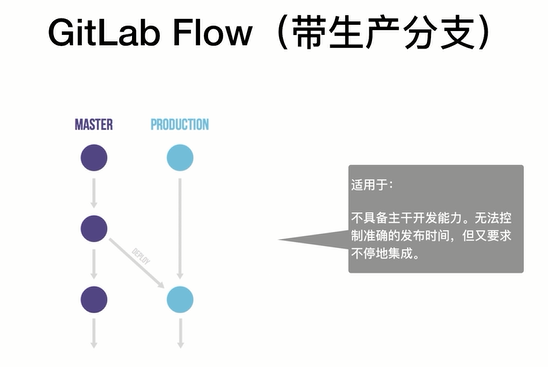

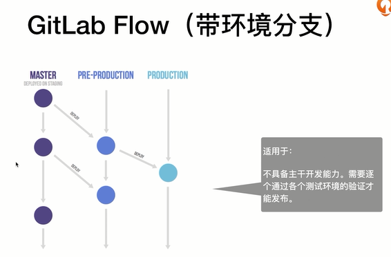

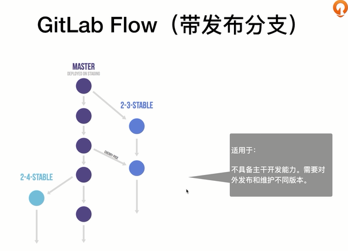


## 如何挑选合适的分支集成策略？

- 具体仓库  > Insights

- 具体仓库  > settings
    - Merge button

```
1. Allow merge commits  
Add all commits from the head branch to the base branch with a merge commit.

2. Allow squash merging  
Combine all commits from the head branch into a single commit in the base branch.

3. Allow rebase merging  
Add all commits from the head branch onto the base branch individually.
```

## 启用issue跟踪需求和任务

注意分类


## 如何用project管理issue？

看板

https://github.com/ShenBao?tab=projects

https://github.com/ShenBao/git-notes/projects


## 项目内部怎么实施code review？

https://github.com/ShenBao/git-notes/settings/branches

pr 需要 rv 之后才可以合并


## 团队协作时如何做多分支的集成？

根据实际来操作

```
git fetch

git rebase origin/master

vi readme

git add .

git rebase --continue


git config --global rerere.enabled true


```

`以上命令可能前后无关联`


## 怎样保证集成的质量？

https://github.com/user-name/xxx-xxx/settings/installations


设置保护分支

https://github.com/user-name/xxx-xxx/settings/branches


marketplace：https://github.com/marketplace


## 怎样把产品包发布到GitHub上？

releases

https://github.com/user-name/xxx-xxx/releases


配置 .travls.yml 文件


## 怎么给项目增加详细的指导文档？

Wiki


## 国内互联网企业为什么喜欢GitLab？

https://about.gitlab.com/

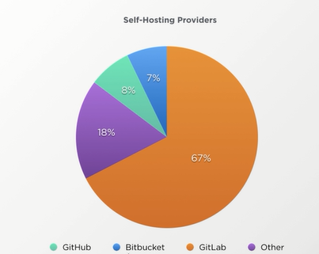

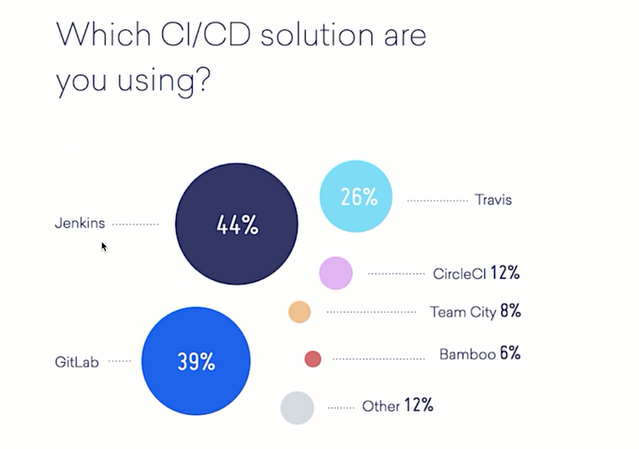

## GitLab有哪些核心的功能？

https://about.gitlab.com/devops-tools

https://about.gitlab.com/stages-devops-lifecycle


Pipeline

Docker


## GitLab上怎么做项目管理？


以这个为示例：
https://gitlab.com/gitlab-org/gitlab-ee


## GitLab上怎么做code review？

与github基本类似

https://gitlab.com/gitlab-org/gitlab-ee


## GitLab上怎么保证集成的质量？

.gitlab-ci.yml 配置文件

Runners


## 怎么把应用部署到AWS上？


对前面持续集成等的综合应用

